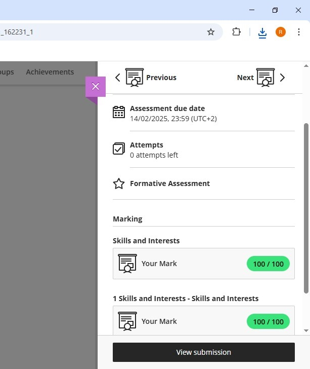

# Work-readiness-training
My digital portfolio serves as a structured showcase of my work readiness journey, highlighting my career aspirations, skills, personality insights, and professional documents such as my CV. It provides potential employers, mentors, and peers with a clear overview of my qualifications, interests, and growth. 

---

## 1. 🎓 Career Counselling

During career counselling, I explored different career paths that align with my strengths and interests. I learned about:

- [ ] Effective job searching strategies  
- [ ] How to align career choices with values  
- [ ] Short- and long-term goal setting  

Situation: I attended career counseling to explore potential career paths and understand the skills required for my dream job.  
Task: My goal was to identify a profession that aligns with my strengths, interests, and personality.  
Action: I participated in various assessments, had discussions with a career advisor, and researched industries that match my skills.  
Result: I gained clarity on pursuing a career in [your chosen field], identified necessary skills, and developed an actionable career plan.

---

## 2. 🧠 Skills and Interests

### 🔧 Skills:
- Communication
- Teamwork
- Problem-solving
- Time management

### 💡 Interests:
- Technology and Innovation  
- Environmental Sustainability  
- Education and Youth Empowerment

Situation: I wanted to assess my current skill set and determine how my interests could influence my professional path.  
Task: My objective was to recognize the skills I excel in and discover areas for improvement.  
Action: I took self-assessments, listed transferable skills, engaged in online courses, and practiced relevant activities.  
Result: I identified strengths in [list your key skills], realized an interest in [mention your interests], and formulated steps to enhance my skill set.

---

## 3. 🧬 Personality Assessment

Based on my personality assessment, I discovered the following:

- **Personality Type:** [e.g., INFJ – The Advocate]  
- **Strengths:** Empathetic, strategic, organized  
- **Weaknesses:** Perfectionism, overthinking

Situation: I completed a personality assessment to understand my strengths, working style, and how my traits align with different career options.  
Task: The goal was to leverage my personality insights to make informed career decisions and improve personal development.  
Action: I reflected on my personality test results, analyzed career paths suited to my traits, and sought feedback from mentors.  
Result: I discovered that my personality type is [e.g., INTJ, ENFP], which aligns well with roles in [industry/profession], and adapted strategies for personal growth.

---

## 4. 📄 My CV (Curriculum Vitae)

You can find my CV [here](./CV_Victoria.pdf).  
*(Make sure to upload your CV to the repo as a PDF file named `CV_YourName.pdf`)*

Situation: I needed a professional CV that effectively showcases my experience, skills, and achievements to potential employers.  
Task: The task was to design a well-structured CV that highlights my qualifications and aligns with industry standards.  
Action: I researched CV formats, tailored sections based on my strengths, and used a clean layout with concise descriptions.  
Result: I created a compelling CV that presents my profile effectively, making me more marketable to recruiters and employers.

---

## 5. ✅ CV Submission

I have submitted my CV as part of the assessment via:
- ✅ Uploaded to GitHub Repository
- ✅ Sent via email to [Instructor’s Email or Submission Platform]

Situation: I submitted my CV to companies as part of my job application process.  
Task: The aim was to apply for a position that matches my qualifications and gain feedback on my CV presentation.  
Action: I carefully selected job postings, tailored my CV to each application, and followed submission guidelines.  
Result: I successfully sent out my CV to [mention companies], received valuable feedback, and improved my job application approach.

---

## 📬 Contact Information

- **Name:** [Reitumetse Victoria Modise]  
- **Email:** [reitumodise@gmail.com]   

Thank you for visiting my portfolio!
